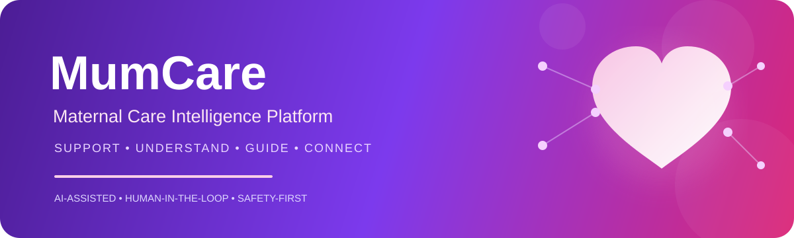

<div align="center">
  
</div>

<br>
<div align="center">

# 🩷 MumCare

### Maternal Care Intelligence & Support Platform

**Continuous maternal support • Context-aware guidance • Human-in-the-loop care**

<br>


</div>

---

## 🧠 What is MumCare?

**MumCare is an AI-assisted maternal care intelligence platform designed to bridge the gap between episodic clinical care and continuous at-home support.**

Pregnancy and postpartum care do not happen only inside hospitals.

Between appointments, mothers may experience uncertainty about symptoms, difficulty understanding medical information, missed medications or appointments, emotional stress, and a lack of accessible support.

MumCare is designed around one principle:

> **Healthcare should not disappear between appointments.**

Instead of functioning as a simple chatbot or reminder application, MumCare brings together:

* 💗 Emotional and mood support
* 📄 Medical document intelligence
* 🚦 Symptom risk guidance
* ⏰ Care reminders
* 🥗 Wellness guidance
* 👩‍⚕️ Professional healthcare access
* 🧠 Longitudinal maternal context

---

# 🎯 The Problem

Maternal healthcare is often centered around scheduled appointments, while most of a mother's journey happens **outside the clinic**.

This creates four major gaps.

### 01 — Emotional Isolation

Pregnancy and postpartum life can involve anxiety, stress, uncertainty, and loneliness.

MumCare provides a supportive digital environment for regular emotional check-ins and continuous engagement.

### 02 — Fragmented Health Information

Reports, prescriptions, test results, and care instructions are frequently scattered across documents and applications.

MumCare introduces a centralized health-information layer for organizing and processing maternal-care documents.

### 03 — Symptom Uncertainty

A mother may not know whether a symptom should simply be monitored, discussed with a doctor, or treated as potentially urgent.

MumCare introduces a **risk-oriented symptom guidance layer** focused on appropriate next actions rather than autonomous diagnosis.

### 04 — Care Gaps Between Appointments

Traditional healthcare interactions can be episodic.

MumCare introduces continuous digital touchpoints through:

```text
Daily Check-ins
      +
Reminders
      +
Health Information
      +
Wellness Guidance
      +
Care Navigation
      ↓
Continuous Maternal Support
```

---

# 🏗️ System Architecture

MumCare is designed as a **context-aware care orchestration system**, rather than a standalone conversational assistant.

```text
                         ┌─────────────────────────┐
                         │         MUMCARE         │
                         │      USER INTERFACE     │
                         └────────────┬────────────┘
                                      │
                                      ▼
                    ┌────────────────────────────────┐
                    │      MATERNAL CONTEXT ENGINE   │
                    │                                │
                    │ Profile • Timeline • Symptoms  │
                    │ Mood • Documents • Care Events │
                    └───────────────┬────────────────┘
                                    │
             ┌──────────────────────┼──────────────────────┐
             │                      │                      │
             ▼                      ▼                      ▼
    ┌─────────────────┐    ┌─────────────────┐    ┌─────────────────┐
    │    DOCUMENT     │    │ RISK & SYMPTOM  │    │    WELLNESS     │
    │   INTELLIGENCE  │    │   GUIDANCE      │    │    ENGINE       │
    │                 │    │                 │    │                 │
    │ OCR             │    │ Risk Signals    │    │ Mood            │
    │ Extraction      │    │ Severity        │    │ Nutrition       │
    │ Structuring     │    │ Escalation      │    │ Activity        │
    └────────┬────────┘    └────────┬────────┘    └────────┬────────┘
             │                      │                      │
             └──────────────────────┼──────────────────────┘
                                    ▼
                     ┌───────────────────────────┐
                     │      CARE ORCHESTRATOR    │
                     │                           │
                     │   Determine next action  │
                     └─────────────┬─────────────┘
                                   │
                  ┌────────────────┼────────────────┐
                  ▼                ▼                ▼
           ┌────────────┐   ┌────────────┐   ┌─────────────┐
           │ SELF-CARE  │   │ CLINICAL   │   │  EMERGENCY  │
           │ GUIDANCE   │   │ REFERRAL   │   │ ESCALATION  │
           └────────────┘   └──────┬─────┘   └─────────────┘
                                   │
                                   ▼
                         ┌─────────────────────┐
                         │   HUMAN OVERSIGHT   │
                         │                     │
                         │ Verified Clinicians │
                         │ Chat • Call • Video │
                         └──────────┬──────────┘
                                    │
                                    ▼
                         ┌─────────────────────┐
                         │  CONTINUOUS FEEDBACK│
                         │        LOOP         │
                         └──────────┬──────────┘
                                    │
                                    └──────► CONTEXT UPDATE
```

---

# 🧬 Maternal Context Engine

The central architectural idea behind MumCare is a **longitudinal maternal context layer**.

Instead of treating every interaction as an isolated conversation, the platform is designed to maintain a structured representation of relevant user context.

```text
Pregnancy Stage
      +
Reported Symptoms
      +
Mood History
      +
Health Documents
      +
Care Events
      +
Previous Interactions
      ↓
┌─────────────────────────────┐
│    MATERNAL CONTEXT MODEL   │
└─────────────────────────────┘
      ↓
Context-aware assistance
```

This allows future recommendations to consider the user's evolving journey rather than only their latest message.

---

# 📄 Medical Document Intelligence

Medical documents can be difficult to interpret and easy to lose.

MumCare proposes a document intelligence pipeline capable of transforming unstructured documents into structured information.

### Supported document concepts

* Medical reports
* Prescriptions
* Test results
* Doctor instructions
* Healthcare documents

### Processing Pipeline

```text
Document Upload
      ↓
Secure Ingestion
      ↓
OCR / Text Extraction
      ↓
Information Extraction
      ↓
Entity Recognition
      ↓
Structured Health Data
      ↓
Maternal Timeline
```

The long-term objective is to make healthcare information:

**searchable → structured → contextual → useful**

while preserving user control and privacy.

---

# 🚦 Symptom Risk Guidance

MumCare does **not** attempt to replace clinical diagnosis.

Instead, its symptom guidance layer is designed around **risk-oriented action categories**.

```text
             USER REPORTS SYMPTOM
                       │
                       ▼
              CONTEXT ANALYSIS
                       │
                       ▼
                RISK ASSESSMENT
                       │
          ┌────────────┼────────────┐
          ▼            ▼            ▼
       MONITOR      CONSULT       URGENT
          │            │            │
          ▼            ▼            ▼
       Observe      Doctor       Immediate
       + track      Review       attention
```

The objective is to help users understand **what kind of next step may be appropriate**, while directing potentially serious situations toward qualified professionals.

---

# 💗 Emotional & Mood Intelligence

Maternal care is not only physical.

MumCare incorporates regular emotional check-ins designed to understand changes in:

* Mood
* Stress
* Anxiety indicators
* Emotional well-being
* Feelings of isolation

The system is **not intended to independently diagnose mental-health conditions**.

Instead, emotional signals can contribute to a broader support context and help identify when additional human support may be appropriate.

---

# ⏰ Intelligent Care Timeline

MumCare can coordinate important maternal-care events:

```text
Medication
    │
    ├── Doctor Appointment
    │
    ├── Medical Test
    │
    ├── Follow-up
    │
    └── Daily Check-in
              ↓
       Unified Care Timeline
```

This transforms scattered reminders into a centralized maternal-care workflow.

---

# 🥗 Wellness Intelligence

The platform can provide **general stage-aware wellness guidance** around:

* Nutrition
* Hydration
* Healthy lifestyle habits
* Appropriate low-impact activity
* Rest
* Emotional well-being

The system is intended to provide **general informational guidance**, not individualized medical prescriptions.

---

# 👩‍⚕️ Human-in-the-Loop Healthcare

One of MumCare's strongest design principles is:

> **AI should assist healthcare — not replace healthcare professionals.**

When professional expertise is required, MumCare can route users toward verified healthcare providers.

Potential consultation channels include:

```text
AI Support
    ↓
Need for Professional Expertise?
    ↓
┌───────────────┐
│      YES      │
└───────┬───────┘
        ↓
Verified Healthcare Professional
        ↓
Chat / Voice / Video
        ↓
Human-led Care
```

This creates a deliberate boundary between **AI assistance** and **clinical decision-making**.

---

# 🔐 Privacy & Safety by Design

Healthcare information is highly sensitive.

MumCare therefore follows a safety-first architectural philosophy.

### Data Minimization

Collect only information necessary for the requested functionality.

### Explicit Consent

Users should understand what information is collected and why.

### Human Oversight

AI should not become an autonomous medical decision-maker.

### No AI Prescriptions

The AI layer should never independently prescribe medication.

### Escalation First

Potentially serious situations should prioritize professional intervention.

### Transparent AI

Users should know when they are interacting with an AI-assisted system.

---

# 🧩 Technical Architecture

MumCare is designed around a modular technology architecture.

| Layer             | Technologies                    |
| ----------------- | ------------------------------- |
| 📱 Mobile         | Flutter / React Native          |
| ⚙️ Backend        | FastAPI / Node.js / Django      |
| 🧠 AI             | Python                          |
| 💬 NLP            | LLM APIs / Transformer Models   |
| 📄 Document AI    | OCR + Information Extraction    |
| 🗄️ Database      | PostgreSQL / MongoDB / Firebase |
| 🔐 Authentication | OAuth 2.0 / JWT                 |
| 🔔 Notifications  | Push Notifications / SMS        |
| ☁️ Infrastructure | AWS / Azure / GCP               |
| 📊 Observability  | Logging + Monitoring            |

The architecture intentionally separates:

```text
Application Layer
        ↓
AI / Intelligence Layer
        ↓
Safety & Policy Layer
        ↓
Data Layer
        ↓
Infrastructure
```

---

# 🔄 End-to-End Workflow

```text
01  ONBOARD
        ↓
02  BUILD MATERNAL CONTEXT
        ↓
03  CAPTURE DAILY SIGNALS
        ↓
04  PROCESS HEALTH DOCUMENTS
        ↓
05  ANALYZE SYMPTOMS & WELLNESS
        ↓
06  GENERATE APPROPRIATE GUIDANCE
        ↓
07  DETECT NEED FOR ESCALATION
        ↓
08  CONNECT WITH PROFESSIONAL CARE
        ↓
09  UPDATE MATERNAL CONTEXT
        ↓
10  CONTINUE SUPPORT
```

This transforms MumCare from a collection of features into a **continuous care-support loop**.

---

# 🧠 What Makes MumCare Different?

Many digital-health products treat capabilities as isolated utilities:

```text
Chatbot
   +
Reminder App
   +
Document Storage
   +
Doctor Marketplace
```

MumCare instead proposes a shared **maternal context layer** connecting these capabilities.

```text
                   MATERNAL CONTEXT
                          │
          ┌───────────────┼───────────────┐
          │               │               │
         Mood         Documents        Symptoms
          │               │               │
          └───────────────┼───────────────┘
                          │
                   CARE ORCHESTRATOR
                          │
              ┌───────────┼───────────┐
              ▼           ▼           ▼
          Wellness      Doctor     Escalation
```

The key idea is **context continuity**.

The system should not simply answer:

> "What did the user ask?"

It should eventually reason about:

> **"What does this interaction mean in the context of the mother's broader care journey?"**

---

# 📈 Expected Impact

| Area                      | Potential Impact                                    |
| ------------------------- | --------------------------------------------------- |
| 💗 Emotional Well-being   | Reduce feelings of isolation                        |
| 📚 Health Awareness       | Improve access to understandable health information |
| 🔄 Care Continuity        | Support users between appointments                  |
| 🚦 Risk Awareness         | Encourage timely professional attention             |
| 👩‍⚕️ Healthcare Access   | Simplify connection with professionals              |
| 📄 Information Management | Centralize important health documents               |
| ⏰ Care Adherence          | Reduce missed care activities                       |

---

# 🚀 Roadmap

### Phase I — Prototype

* [x] Core product concept
* [x] Maternal support workflow
* [x] Feature architecture
* [x] Symptom guidance concept
* [x] Medical document workflow
* [x] Doctor consultation concept

### Phase II — Intelligence Layer

* [ ] Maternal context engine
* [ ] Document OCR pipeline
* [ ] Medical information extraction
* [ ] Retrieval-augmented generation
* [ ] Personalized conversational assistant
* [ ] Risk signal engine
* [ ] Longitudinal health timeline

### Phase III — Care Infrastructure

* [ ] Secure authentication
* [ ] Encrypted health-data storage
* [ ] Doctor verification
* [ ] Consultation workflow
* [ ] Emergency escalation
* [ ] Notification infrastructure
* [ ] Audit logging

### Phase IV — Production Intelligence

* [ ] Multimodal health understanding
* [ ] Personalized care pathways
* [ ] Maternal knowledge graph
* [ ] Clinical-safety evaluation framework
* [ ] Model evaluation pipeline
* [ ] AI observability
* [ ] Privacy-preserving analytics

---

# 🤖 Responsible AI

MumCare follows a **human-in-the-loop AI philosophy**.

The intended AI role is:

```text
ASSIST
  ↓
INFORM
  ↓
GUIDE
  ↓
IDENTIFY NEED FOR ESCALATION
  ↓
HUMAN PROFESSIONAL
```

It should **not**:

```text
✗ Diagnose autonomously
✗ Prescribe medication
✗ Replace clinicians
✗ Guarantee medical outcomes
✗ Override professional medical judgment
```

The AI layer therefore functions as a **support and navigation mechanism**, not an autonomous medical authority.

---

# 🔬 Future Research Directions

MumCare can evolve into a deeper research platform around:

### Multimodal Maternal Intelligence

Combining text, documents, structured health signals, and conversational information.

### Longitudinal Health Modeling

Understanding how maternal context changes over time.

### Retrieval-Augmented Healthcare Assistance

Grounding AI responses in curated and trusted healthcare knowledge.

### Personalized Care Pathways

Adapting support according to individual context rather than providing generic recommendations.

### Knowledge Graphs

Representing relationships between symptoms, care events, documents, medications, appointments, and maternal context.

### Safety Evaluation

Building measurable frameworks for:

* Hallucination detection
* Risk classification
* Escalation accuracy
* Response reliability
* Human oversight

---

# 🌍 Vision

> ## No mother should feel alone, confused, or unsupported between appointments.

MumCare envisions a future where maternal healthcare is not limited to hospital visits.

Instead, mothers can have access to a continuous digital support layer that:

**understands context → organizes information → provides appropriate guidance → recognizes uncertainty → connects humans when needed.**

The ultimate goal is not to make healthcare more automated.

It is to make healthcare **more accessible, continuous, organized, and human-centered.**

---

Developed by: Sanchita Yadav 

Theme:

**Maternal & Child Care**

---

# ⚠️ Medical Disclaimer

MumCare is an **academic/prototype software project** and is not a medical device or substitute for professional medical care.

AI-generated information should not be used as a diagnosis, emergency decision, or treatment plan.

For urgent or emergency situations, users should contact local emergency services or a qualified healthcare professional.

---

<div align="center">

### 🩷 MumCare

**Technology should make healthcare more human — not less.**

</div>
